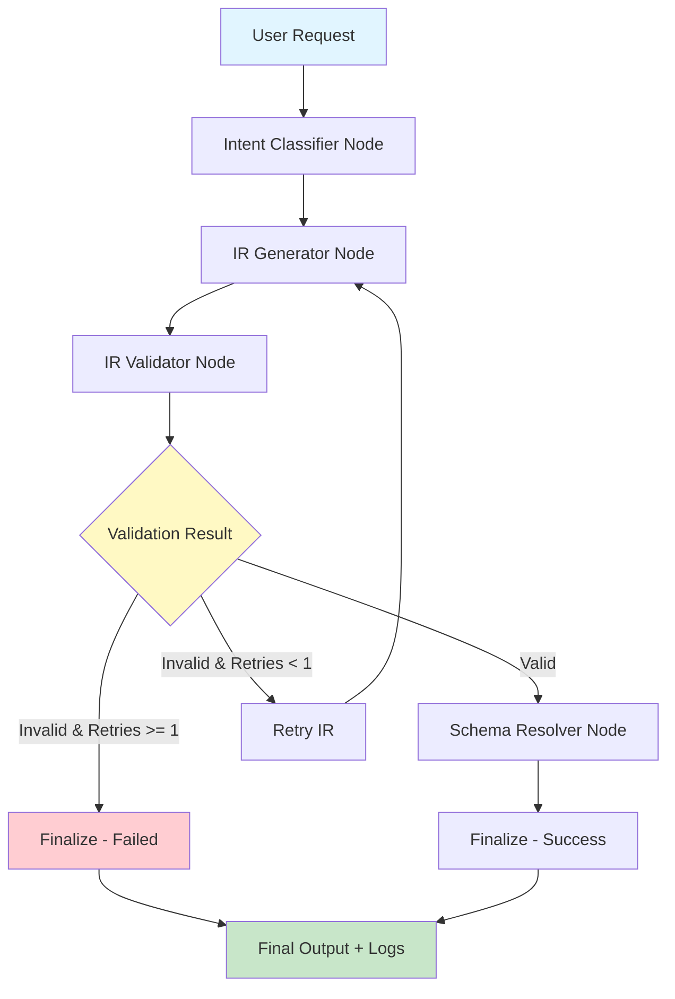
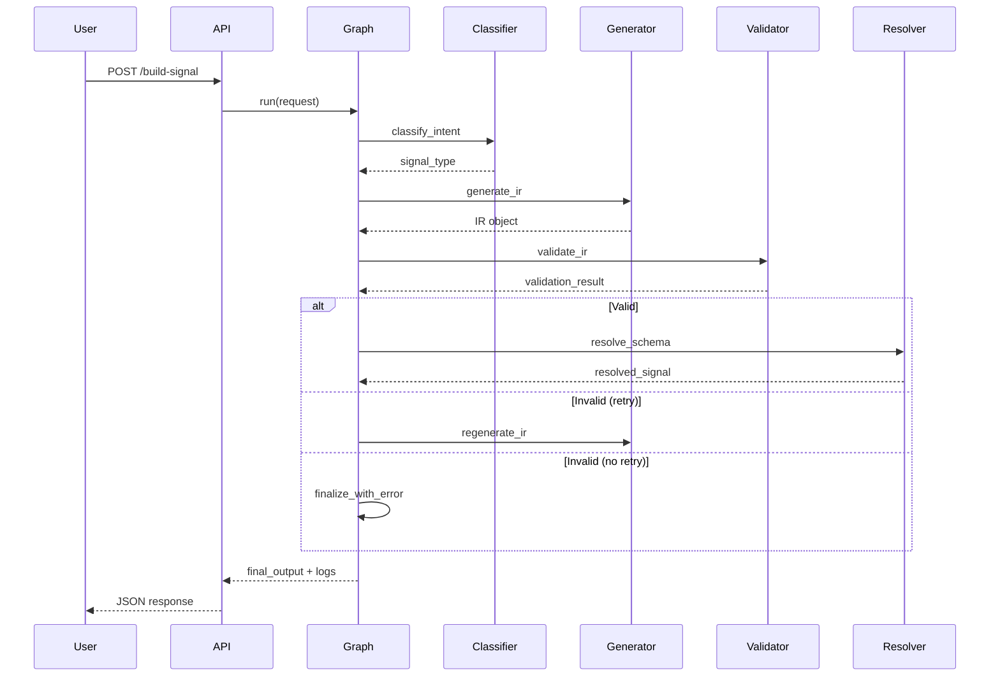
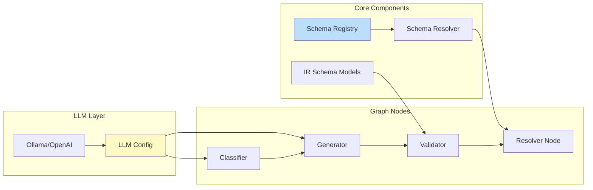
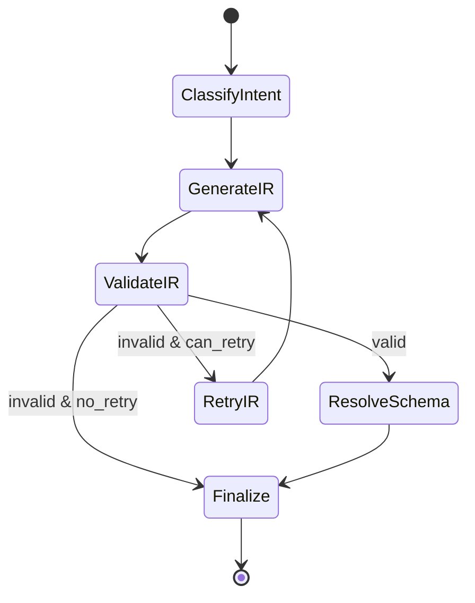

# Architecture Diagram

## System Architecture

```mermaid
graph TD
    A[User Request] --> B[Intent Classifier Node]
    B --> C[IR Generator Node]
    C --> D[IR Validator Node]
    D --> E{Validation Result}
    E -->|Valid| F[Schema Resolver Node]
    E -->|Invalid & Retries < 1| G[Retry IR]
    E -->|Invalid & Retries >= 1| H[Finalize - Failed]
    G --> C
    F --> I[Finalize - Success]
    H --> J[Final Output + Logs]
    I --> J
    
    style A fill:#e1f5ff
    style J fill:#c8e6c9
    style E fill:#fff9c4
    style H fill:#ffcdd2
```

## Data Flow

```mermaid
sequenceDiagram
    participant User
    participant API
    participant Graph
    participant Classifier
    participant Generator
    participant Validator
    participant Resolver
    
    User->>API: POST /build-signal
    API->>Graph: run(request)
    Graph->>Classifier: classify_intent
    Classifier-->>Graph: signal_type
    Graph->>Generator: generate_ir
    Generator-->>Graph: IR object
    Graph->>Validator: validate_ir
    Validator-->>Graph: validation_result
    alt Valid
        Graph->>Resolver: resolve_schema
        Resolver-->>Graph: resolved_signal
    else Invalid (retry)
        Graph->>Generator: regenerate_ir
    else Invalid (no retry)
        Graph->>Graph: finalize_with_error
    end
    Graph-->>API: final_output + logs
    API-->>User: JSON response
```

## Component Architecture

```mermaid
graph LR
    subgraph "Core Components"
        A[Schema Registry]
        B[Schema Resolver]
        C[IR Schema Models]
    end
    
    subgraph "Graph Nodes"
        D[Classifier]
        E[Generator]
        F[Validator]
        G[Resolver Node]
    end
    
    subgraph "LLM Layer"
        H[LLM Config]
        I[Ollama/OpenAI]
    end
    
    A --> B
    B --> G
    C --> F
    H --> D
    H --> E
    I --> H
    D --> E
    E --> F
    F --> G
    
    style A fill:#bbdefb
    style H fill:#fff9c4
```

## State Machine

```mermaid
stateDiagram-v2
    [*] --> ClassifyIntent
    ClassifyIntent --> GenerateIR
    GenerateIR --> ValidateIR
    ValidateIR --> ResolveSchema: valid
    ValidateIR --> RetryIR: invalid & can_retry
    ValidateIR --> Finalize: invalid & no_retry
    RetryIR --> GenerateIR
    ResolveSchema --> Finalize
    Finalize --> [*]
```
